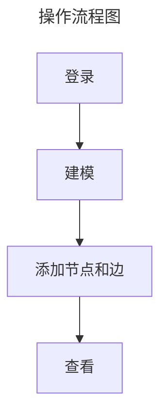

# 使用TuGraph关系数据库

## 介绍

### G6VP

[G6VP](https://github.com/antvis/G6VP/tree/master) 取名意为 AntV G6 Visualization Platform，曾用名 AntV/GraphInsight，它是一款在线图可视分析产品，也是一款图应用的低代码搭建工具。
[线上测试地址](https://insight.antv.antgroup.com/#/open/engines)

### TuGraph介绍

[TuGraph](https://github.com/TuGraph-family/tugraph-db)是G6VP中的多种图数据库的一种,是支持大数据容量、低延迟查找和快速图分析功能的高效图数据库。可本地部署。

[官网](https://tugraph.antgroup.com/)  
[最新文档](https://tugraph-db.readthedocs.io/zh_CN/latest/1.guide.html)

## TuGraph服务搭建

```bash
# 启动docker
docker run -d -p 7070:7070 -p 9090:9090 --name tugraph_demo tugraph/tugraph-runtime-centos7 lgraph_server
# 7070是默认的http端口，web访问使用。
# 9090是默认的rpc端口，rpc client访问使用。

# 手动启动方式
docker run -dt -p 7070:7070 --name tugraph_demo tugraph/tugraph-runtime-centos7
docker exec -it tugraph_demo bash
# 进入docker环境后执行如下命令启动服务
lgraph_server -d start
```

相关[文档](https://tugraph-db.readthedocs.io/zh_CN/latest/3.quick-start/1.preparation.html#id5)  
启动成功后[访问](http://localhost:7070)

> 账号: admin  
> 密码: 73@TuGraph

如需二次开发前端服务可从[TuGraph-family/tugraph-web](https://github.com/TuGraph-family/tugraph-web)上克隆代码进行二次开发

## 基础使用


